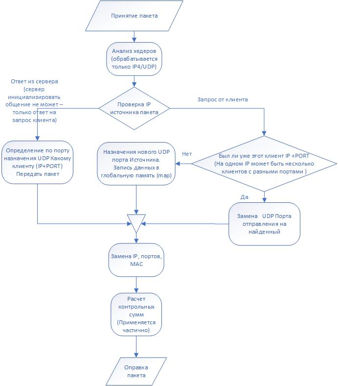

# XDP Балансер

**Задание**

    Write XDP load balancer in C based on source and destination ip hash.
    The simplest test is to use network namespaces.

**Результат**

    Данная программа - пример балансера сетевой нагрузки. 
    Поддерживается IPv4 и UDP протокол.

**Принцип работы**

    Помимо замены IP и MAC происходит переназначение UDP портов. 
    Т.е. назначается новый порт в пакете и отправляется серверу,
    сервер отвечает на тот же самый порт и по этому номеру порта 
    определяется какому клиенту отправлять полученный от сервера пакет.
    Пример:
    Пришел пакет от 172.11.0.22:5555 пакет отправляется с балансера на 
    сервер с 172.11.0.1:6666. Ожидается что сервер ответит на порт 6666.
    В соответствии с портом 6666 ищется клиент, которому необходимо передать пакет от сервера.

**Краткий алгоритм работы**

**Проблемы**

    Т.к. задание выполнялось исключительно в виртуальной сети возникла 
    сложность с расчетом контрольной суммы UDP пакета.
    По аналогичной причине проблема с MAC адресами - устройство vlan 
    использует MAC host устройства. 

**Продолжение**

    1.Имплементация поддержки TCP протокола
    2.Имплементация поддержки IPv6

## Команды терминала

### Терминал 1
===========================================================

`sudo scripts/set_net.sh`

`cd src`

`make`

`sudo ip -force link set dev balancer xdp object xdp_redirect.o  verbose`

`../scripts/set_map.sh`

\# ***Вывод идет в канал трассировки ядра, который нужно включить:***

`echo -n 1 | sudo tee /sys/kernel/debug/tracing/options/trace_printk`

\# ***Просмотр потока сообщений:***

`sudo cat /sys/kernel/debug/tracing/trace_pipe`

### Терминал 2
===========================================================

`sudo nsenter --net=/var/run/netns/test_ns bash`

`../UDP/UDP_echo_server.py 172.11.0.20`

### Терминал 3
===========================================================

`sudo nsenter --net=/var/run/netns/test_ns bash`

`../UDP/UDP_echo_server.py 172.11.0.21`

### Терминал 4
===========================================================

`sudo nsenter --net=/var/run/netns/test_ns bash`

`ip -force link set dev veth xdp object xdp_pass.o verbose`

`../UDP/UDP_client.py  172.11.0.1 172.11.0.22`

`../UDP/UDP_client.py  172.11.0.1 172.11.0.23`

`../UDP/UDP_client.py  172.11.0.1 172.11.0.24`

`../UDP/UDP_client.py  172.11.0.1 172.11.0.25`
